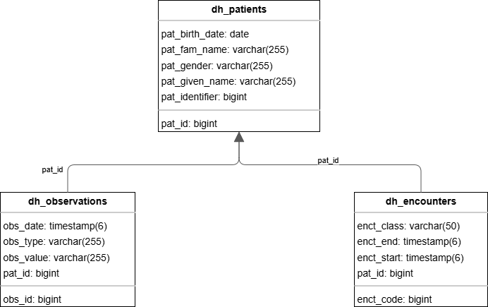
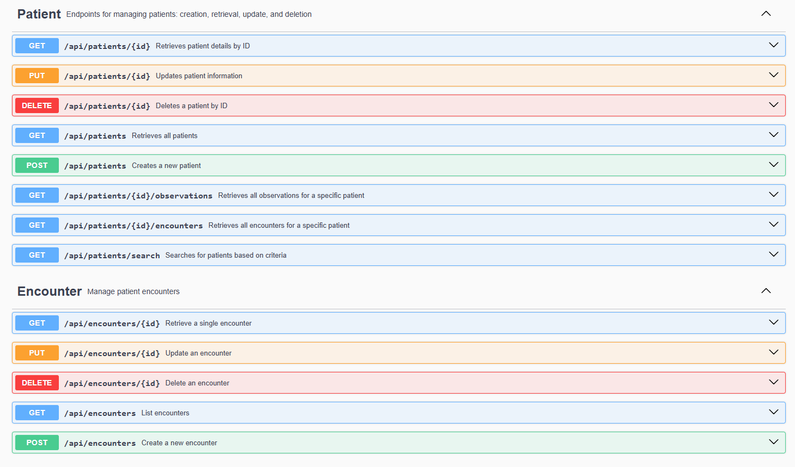

# Digital Health

Minimal Spring Boot service to manage Patients and Encounters.  
Goal: simple, production-minded REST API with JPA/Hibernate (Postgres), validation, clear errors and a small test suite.

## Quick overview
- Java 17, Maven
- Spring Boot (Web, JPA, Validation), Postgres supported via `docker-compose`)
- Spring Security with API Key authentication
- API documented with Swagger/OpenAPI
- Layered structure: controller → service → repository
- Default port: `8080`

## Requirements
- Java 17+
- Maven 3.6+
- Docker & Docker Compose (for Postgres)

## DB
- Naming:
- Tables: used prefix `dh_` to allow easy identification as system grows.
- Columns: Used prefix  eg: `pat_` for Patient table columns, `enct_` for Encounter table columns. for easy identification'
- Relationships:
  - One-to-Many: One Patient can have multiple Encounters.
  - Many-to-One: Each Encounter is linked to one Patient.
  - 
  


## Getting Started
Clone the repository:
```bash
  git clone https://github.com/emmanuel-mutua/digital-health-exercise
 ```


### Build Services with Docker Compose - Database + Application:
```bash
 docker-compose up --build -d
```

### Run service:
```bash
 docker compose up
```

### Stop and remove volumes:
```bash
 docker-compose down -v
```

### Or Run project with Maven:
```bash
  mvn spring-boot:run
```

## How to use 
Access documentation at Swagger UI -> Includes all endpoints and: models:
```
 http://localhost:8080/swagger-ui/index.html
```


### SWAGGER / OPENAPI
- For any Api Request, include Header: `Authorization: DH-4321!`



### Run Tests
```bash
  mvn test
```

## Tradeoffs
Keeping the existing database schema
Pros: Keeps current data safe and is quick to set up.
Cons: Can hide small database changes and may cause problems when adding new migrations later.

Turning off Flyway in development or tests
Pros: Runs faster and avoids migration errors.
Cons: Your test database may not match what is used in production.

Using your own Spring Security setup instead of the default
Pros: You control everything and avoid the random password that Spring creates.
Cons: Takes more setup and configuration.
Default setup Pros: Works immediately without setup.
Default setup Cons: Can be insecure or confusing because of the random password.

Using an API key filter instead of turning off security
Pros: Keeps the app stateless and still protected.
Cons: You must handle authentication and user roles correctly in code.
Turning off security Pros: Easy and fast for testing.
Turning off security Cons: Removes important protections.

Disabling security in tests or testing with real authentication
Pros (disable): Easier and faster to test.
Cons (disable): May miss real security bugs.
Pros (real auth): Catches real issues early.
Cons (real auth): Takes more setup time.

Using H2 database or Postgres for tests
Pros (H2): Very fast and runs in memory.
Cons (H2): Works differently from Postgres, which may cause errors later.
Pros (Postgres): Matches production closely and more reliable.
Cons (Postgres): Slower and harder to set up.